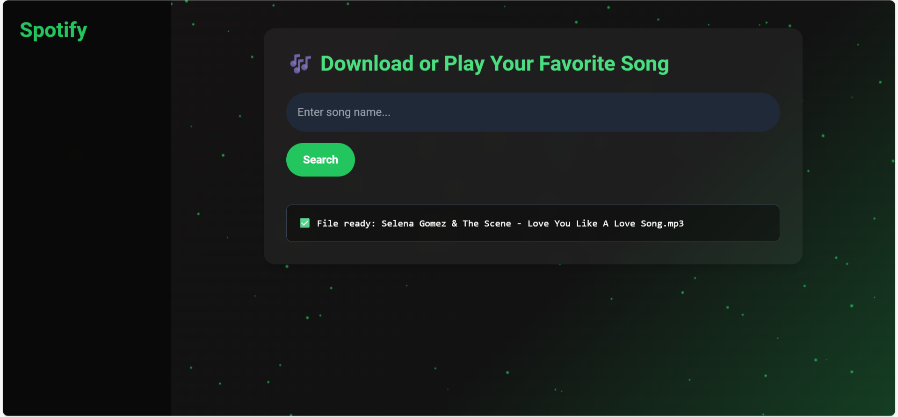

# 🎵 Spotify Downloader — **EchoFetch**

A **modern, enterprise-class Spotify downloader** web application built with **Flask**, **Spotipy**, **Tailwind CSS**, and **GSAP**. Search and download songs instantly with a beautiful, animated, mobile-friendly UI.

> 🔒 Powered by Spotify’s official public API using [Spotipy](https://spotipy.readthedocs.io/)  
> ✨ Sleek, animated interface with [GSAP](https://greensock.com/gsap/) and [TailwindCSS](https://tailwindcss.com/)  
> ⚡ Fast Python Flask backend  
> 📁 Local download management  
> 🚀 100% open source — contribute, build, remix!

## 🌟 Live Preview

<p align="center">
  <a href="https://echofetch-production.up.railway.app/" target="_blank">
    
  </a>
</p>

<p align="center">
  <b>Modern, clean, and user-friendly interface — responsive on any device.</b><br>
  <a href="https://echofetch-production.up.railway.app/" target="_blank">🚀 Try it live &rarr;</a>
</p>


_Hosted on Railway_

## 🚀 Features

- ✅ Spotify API track search  
- ✅ Download by ID or full URL  
- ✅ Ultra-smooth, non-boring GSAP UI animations  
- ✅ Mobile-first responsive layout  
- ✅ Real-time logging via Flask backend  
- ✅ User-friendly error and progress feedback  
- ✅ Quick audio streaming & downloading

## 🛠️ Tech Stack

| Tech        | Usage                                 |
|-------------|---------------------------------------|
| Flask       | Backend Python web server             |
| Spotipy     | Spotify Web API (client credentials)  |
| GSAP        | Frontend UI animations                |
| TailwindCSS | Rapid frontend styling                |
| HTML/JS     | UI logic & user events                |

## 🔐 Setup & Installation

### 1. Clone the repository

```bash
git clone https://github.com/oolalabravo/EchoFetch.git
cd EchoFetch
```

### 2. Install dependencies

```bash
pip install -r requirements.txt
```

### 3. Configure your Spotify secrets

Create a `.env` file in your root folder, or set these as environment variables:

```ini
SPOTIPY_CLIENT_ID=your_client_id
SPOTIPY_CLIENT_SECRET=your_client_secret
```

> ⚠️ **Do not put quotes around secrets!** Save secrets as they appear, treat them carefully.

### 4. (Optional) Ensure [spotdl](https://spotdl.io) and `ffmpeg` are installed and available in your system PATH for music downloading & conversion.

## 🔧 Running the App

```bash
python app.py
```

Visit [http://127.0.0.1:5000/](http://127.0.0.1:5000/) in your browser.

You should now see your elegant Spotify downloader, with live GSAP transitions and responsive UI.

## 🪲 Troubleshooting

| Problem                    | Solution                                                |
|----------------------------|--------------------------------------------------------|
| `invalid_client` error     | Double-check your client secret, and ensure no quotes. |
| Song won't download        | Check your network & spotdl/ffmpeg installation.        |
| UI not animating           | Ensure Tailwind CDN & GSAP links are correct.           |

## 🏷️ Tags

`spotify` `downloader` `flask` `python` `tailwind` `gsap` `webapp` `music` `spotipy` `animation` `open-source`

## 📄 License

Licensed under the [MIT License](./LICENSE).

## 🙌 Acknowledgments

- [Spotipy Documentation](https://spotipy.readthedocs.io/)
- [GSAP Animations](https://greensock.com/gsap/)
- [TailwindCSS](https://tailwindcss.com/)
- [spotdl - Spotify Downloader](https://spotdl.io)

## 💡 Roadmap & Ideas

_EchoFetch is always evolving — your ideas help!_

- ✅ Dark mode toggle
- 🎨 Custom themes and color palettes
- 📱 Enhanced mobile PWA features
- ⚡ Advanced loading & status animations
- 📊 Usage analytics dashboard
- 🧠 AI-powered song recommendations (soon… 👀)

## 🤝 Contributing & Feedback

Whether you’re a developer, designer, or power user — PRs, issues, ideas, and improvements are warmly welcomed!  
⭐ _If you like the project, star it and share your ideas!_

> Made with ❤️ by [Bhvaya Sharma](https://github.com/oolalabravo)  
> [EchoFetch on GitHub](https://github.com/oolalabravo/EchoFetch)
